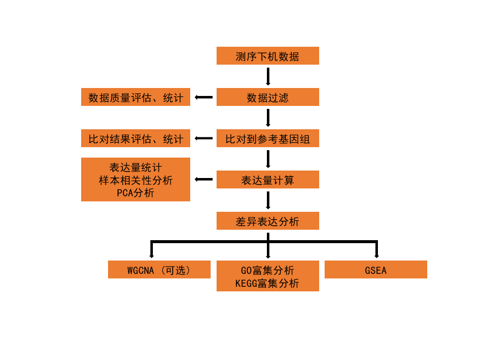

```{R global, include=FALSE}
knitr::opts_chunk$set(
  echo = FALSE,
  fig.align = "center"
)
library(tidyverse)
aligner <- "STAR"  # STAR or hisat2
genome <- "油菜ZS11"
genome_ref <- "Song, J. M., Guan, Z., Hu, J., Guo, C., Yang, Z., Wang, S., Liu, D., Wang, B., Lu, S., Zhou, R., Xie, W. Z., Cheng, Y., Zhang, Y., Liu, K., Yang, Q. Y., Chen, L. L., & Guo, L. (2020). Eight high-quality genomes reveal pan-genome architecture and ecotype differentiation of Brassica napus. Nature plants, 6(1), 34–45. https://doi.org/10.1038/s41477-019-0577-7"
genome_url <- "http://cbi.hzau.edu.cn/bnapus/"
min_reps <- 2
min_cpm <- 1
log2FC <- 1
de_padj <- 0.05
enrich_pvalue <- 0.05
enrich_qvalue <- 0.05
gsePadj <- 0.05
```

```{R include=FALSE}
dir.create(path = "./result/00.data/00.raw_data/QC", showWarnings = FALSE, recursive = TRUE)
dir.create(path = "./result/00.data/01.clean_data/QC", showWarnings = FALSE, recursive = TRUE)
dir.create(path = "./result/01.Mapping", showWarnings = FALSE, recursive = TRUE)
dir.create(path = "./result/02.Expression", showWarnings = FALSE, recursive = TRUE)
dir.create(path = "./result/03.DE_analysis", showWarnings = FALSE, recursive = TRUE)
dir.create(path = "./result/04.Enrichment/01.ORA", showWarnings = FALSE, recursive = TRUE)
dir.create(path = "./result/04.Enrichment/02.GSEA", showWarnings = FALSE, recursive = TRUE)
```

```{R read_info, include=FALSE}
anno <- read_tsv(file = "./db/functionalAnnotation.txt")

sampleInfo <- read_tsv(file = "./00.data/samples.txt", col_names = c("Group", "Sample", "fq_1", "fq_2")) %>% 
  mutate(fq_1 = basename(fq_1), fq_2 = basename(fq_2))
write_csv(x = sampleInfo, file = "./result/00.data/sampleInfo.csv")

file.copy(from = paste("./00.data/00.raw_data/QC/", str_replace(string = sampleInfo$fq_1, pattern = ".fq$|.fq.gz$|.fastq$|.fastq.gz$", replacement = "_fastqc.html"), sep = ""), to = paste("./result/00.data/00.raw_data/QC/", str_replace(string = sampleInfo$fq_1, pattern = ".fq$|.fq.gz$|.fastq$|.fastq.gz$", replacement = "_fastqc.html"), sep = ""))
file.copy(from = paste("./00.data/00.raw_data/QC/", str_replace(string = sampleInfo$fq_2, pattern = ".fq$|.fq.gz$|.fastq$|.fastq.gz$", replacement = "_fastqc.html"), sep = ""), to = paste("./result/00.data/00.raw_data/QC/", str_replace(string = sampleInfo$fq_2, pattern = ".fq$|.fq.gz$|.fastq$|.fastq.gz$", replacement = "_fastqc.html"), sep = ""))
file.copy(from = paste("./00.data/01.clean_data/QC/", str_replace(string = sampleInfo$Sample, pattern = "$", replacement = "_1.clean_fastqc.html"), sep = ""), to = paste("./result/00.data/01.clean_data/QC/", str_replace(string = sampleInfo$Sample, pattern = "$", replacement = "_1.clean_fastqc.html"), sep = ""))
file.copy(from = paste("./00.data/01.clean_data/QC/", str_replace(string = sampleInfo$Sample, pattern = "$", replacement = "_2.clean_fastqc.html"), sep = ""), to = paste("./result/00.data/01.clean_data/QC/", str_replace(string = sampleInfo$Sample, pattern = "$", replacement = "_2.clean_fastqc.html"), sep = ""))

dataInfo <- read_tsv(file = "./00.data/data_stat.txt")
write_csv(x = dataInfo, file = "./result/00.data/data_stat.csv")

mapInfo <- read_tsv(file = "./01.Mapping/align_stat.tsv")
write_csv(x = mapInfo, file = "./result/01.Mapping/align_stat.csv")

quantifyInfo <- read_csv(file = "./02.Quantification/Quantification_Stat.csv")
write_csv(x = quantifyInfo, file = "./result/02.Expression/Quantification_Stat.csv")

exprCount <- read.delim(file = "./03.Merge_result/genes.counts.matrix", header = T, row.names = 1, sep = "\t") %>% 
  rownames_to_column(var = "GeneID") %>% as_tibble() %>% 
  left_join(anno, by = "GeneID")
write_csv(x = exprCount, file = "./result/02.Expression/genes.counts.csv")
exprTPM <- read.delim(file = "./03.Merge_result/genes.TPM.not_cross_norm", header = T, row.names = 1, sep = "\t") %>% 
  rownames_to_column(var = "GeneID") %>% as_tibble() %>% 
  left_join(anno, by = "GeneID")
write_csv(x = exprTPM, file = "./result/02.Expression/genes.TPM.csv")
exprTMM <- read.delim(file = "./03.Merge_result/genes.TMM.EXPR.matrix", header = T, row.names = 1, sep = "\t") %>% 
  rownames_to_column(var = "GeneID") %>% as_tibble() %>% 
  left_join(anno, by = "GeneID")
write_csv(x = exprTMM, file = "./result/02.Expression/genes.TMM.csv")
file.copy(from = "./03.Merge_result/correlation.csv", to = "./result/02.Expression/correlation.csv")
file.copy(from = "./03.Merge_result/correlation_with_Cluster.pdf", to = "./result/02.Expression/correlation_with_Cluster.pdf")
file.copy(from = "./03.Merge_result/correlation_with_Cluster.png", to = "./result/02.Expression/correlation_with_Cluster.png")
file.copy(from = "./03.Merge_result/correlation_without_Cluster.pdf", to = "./result/02.Expression/correlation_without_Cluster.pdf")
file.copy(from = "./03.Merge_result/correlation_without_Cluster.png", to = "./result/02.Expression/correlation_without_Cluster.png")
file.copy(from = "./03.Merge_result/genes.TMM.EXPR.boxplot.pdf", to = "./result/02.Expression/genes.TMM.EXPR.boxplot.pdf")
file.copy(from = "./03.Merge_result/genes.TMM.EXPR.boxplot.png", to = "./result/02.Expression/genes.TMM.EXPR.boxplot.png")
file.copy(from = "./03.Merge_result/genes.TMM.EXPR.density.pdf", to = "./result/02.Expression/genes.TMM.EXPR.density.pdf")
file.copy(from = "./03.Merge_result/genes.TMM.EXPR.density.png", to = "./result/02.Expression/genes.TMM.EXPR.density.png")
file.copy(from = "./03.Merge_result/PCAplot_PC1&PC2.pdf", to = "./result/02.Expression/PCAplot_PC1&PC2.pdf")
file.copy(from = "./03.Merge_result/PCAplot_PC1&PC2.png", to = "./result/02.Expression/PCAplot_PC1&PC2.png")

contrast <- read_tsv(file = "./04.DE_analysis/contrasts.txt", col_names = FALSE)
```
# 样本信息
一共`r sampleInfo %>% pull(Group) %>% unique() %>% length()`组`r sampleInfo %>% pull(Sample) %>% unique() %>% length()`个样本。
```{R}
DT::datatable(sampleInfo)
```

# 分析流程
此处使用转录组分析流程laowang1992/RNAseq_workflow<sup>[1](#ref)</sup>进行分析。

```{r, fig.cap="分析流程图", fig.align='center'}

```

## 数据过滤
测序下机后的数据为raw data。使用fastp<sup>[2](#ref)</sup>（version: 0.20.0）对raw data进行过滤，去除测序接头（adapter）、质量较低以及太短的reads得到clean data。统计过滤前后total bases、total reads、Q30、Q20、GC content以及有效数据比率，同时使用FastQC（version: 0.11.8）对过滤前后的数据进行质量评估。

## 比对到参考基因组
使用`r aligner`<sup>[3](#ref)</sup>（version: `r if (aligner=="hisat2") {"2.1.0"} else if (aligner=="STAR") {"2.7.3a"}`）将clean reads比对到`r genome`参考基因组<sup>[4](#ref)</sup>（`r genome_url` ）上，得到SAM（Sequence Alignment/Map）格式文件<sup>[5](#ref)</sup>，然后使用sambamba<sup>[6](#ref)</sup>（version: 0.8.2）对比对结果（SAM文件）按照染色体和位置进行排序并转换为BAM（Binary Alignment/Map）格式文件<sup>[5](#ref)</sup>。HISAT2可以使用更少资源的同时具有更快的速度。比对完成后，我们对比对结果进行评估，统计比对率和唯一比对率以及基因覆盖度。

## 饱和曲线检查
利用转录组数据计算表达量的精度受到样本量（测序深度）的影响，因此需要进行饱和曲线检查。基本思想是分别取总的RNA reads 5%、10%、...、95%、100%并计算RPKM值，如果测序深度饱和，则估计的RPKM值是稳定的或可重复的。具体的算法是通过计算“Percent Relative Error”反应reads子集估计的RPKM值（即RPKM~obs~）偏离真实表达水平（RPKM~real~）的程度，公式如下：

$${Percent Relative Error} = {\cfrac{\lvert RPKM_{obs}-RPKM_{real}\rvert}{RPKM_{real}}}\times100$$

## 计算表达量
根据比对结果（BAM文件），我们使用R（version: 4.2.1）软件的扩展包Rsubread<sup>[7](#ref)</sup>（version: 2.10.5）中的featureCounts函数计算每个基因的表达量（read count）并进行归一化处理（normalization），得到TPM（Transcripts Per Kilobase of exon model per Million mapped reads）和TMM（trimmed mean of M value）表达矩阵。

## 差异表达分析
根据基因表达矩阵（read count）文件，在有生物学重复的情况下，使用R（version: 4.2.1）软件的扩展包DESeq2<sup>[8](#ref)</sup>（version: 1.36.0）进行差异表达分析，在没有生物学重复的情况下，则使用R扩展包edgeR<sup>[9](#ref)</sup>（version: 3.38.4）进行差异表达分析。首先过滤低表达量基因，保留至少在`r min_reps`个样本中表达量大于`r min_cpm` CMP（Counts Per Million）的基因，然后对于log2FoldChange绝对值大于`r log2FC``，并且padj小于`r de_padj`的基因则认为是差异表达基因。

## 富集分析
在差异表达分析之后进行GO和KEGG富集分析。我们使用R（version: 4.2.1）软件的扩展包clusterProfiler<sup>[10](#ref)</sup>（version: 4.4.4）进行Over-representation analysis（ORA）和Gene Set Enrichment Analysis（GSEA）这两种形式的富集分析。ORA是指在按照一定的*p*-adjust和log2FoldChange标准得到差异表达基因并于基因组背景相比较，找到差异表达基因显著富集的GO term或KEGG pathway，此处以adjusted *p*-value < `r enrich_pvalue`为筛选标准。GSEA的基本思想是将基因按照两组样本中差异表达程度排序，检验预先定义的基因集（GO或KEGG）是否排列在顶端或底端，GSEA可以充分利用基因差异表达程度的信息，排除人为筛选差异表达基因的主观性，是一种更先进富集方法，与over-representation富集方法互为补充，此处以*p*.adjust < `r gsePadj`为筛选标准。

### GO富集分析 {-}
Gene Ontology（简称GO）是一个国际标准化的基因功能分类体系，提供了一套动态更新的标准词汇表（controlled vocabulary）来全面描述生物体中基因和基因产物的属性。GO总共有三个ontology（本体），分别描述基因的分子功能（molecular function，MF）、所处的细胞位置（cellular component，CC）、参与的生物过程（biological process，BP）。GO的基本单位是term（词条、节点），每个term都对应一种或一类特定的功能<sup>[11](#ref)</sup>。

### KEGG富集分析 {-}
KEGG（Kyoto Encyclopedia of Genes and Genomes）是系统分析基因产物在细胞中的代谢途径（Pathway）以及这些基因产物功能的主要公共数据库，利用KEGG可以进一步研究基因在生物学上的复杂行为<sup>[12](#ref)</sup>。

# 分析结果
## 数据过滤
对raw data过滤后得到clean data，结果统计如下（./result/00.data/data_stat.csv）：
```{R}
DT::datatable(dataInfo)
```
## 比对到参考基因组 {.tabset .tabset-fade .tabset-pills}
将clean data比对到参考基因上，并统计比对率信息（./result/01.Mapping/align_stat.csv）以及基因覆盖度（./result/01.Mapping/\<sampleName\>.geneBody_coverage.geneBodyCoverage.curves.pdf）。
```{R}
DT::datatable(mapInfo)
```

```{r, results='asis'}
for (i in sampleInfo$Sample) {
  file.copy(from = paste("./01.Mapping/", i, ".geneBodyCoverage.curves.png", sep = ""), to = paste("./result/01.Mapping/", i, ".geneBodyCoverage.curves.png", sep = ""))
  file.copy(from = paste("./01.Mapping/", i, ".geneBodyCoverage.curves.pdf", sep = ""), to = paste("./result/01.Mapping/", i, ".geneBodyCoverage.curves.pdf", sep = ""))
  cat("### ", i, " {-}\n", sep = "")
  cat("\n\n", sep = "")
}
```

## 饱和曲线检查 {.tabset .tabset-fade .tabset-pills}
对样本进行饱和度检查，结果如下：

```{r, results='asis'}
for (i in sampleInfo$Sample) {
  file.copy(from = paste("./01.Mapping/", i, ".saturation.png", sep = ""), to = paste("./result/01.Mapping/", i, ".saturation.png", sep = ""))
  file.copy(from = paste("./01.Mapping/", i, ".saturation.pdf", sep = ""), to = paste("./result/01.Mapping/", i, ".saturation.pdf", sep = ""))
  cat("### ", i, " {-}\n", sep = "")
  cat("\n\n", sep = "")
  cat("**说明：**X轴代表总的RNA reads的抽样百分比，Y轴代表Percent Relative Error， Q1、Q2、Q3、Q4分别表示表达水平（RPKM）在0\\~25%百分位、25\\~50%百分位、50\\~75%百分位、75%\\~100%百分位的基因。\n\n")
}
```

## 计算表达量
根据比对结果进行表达定量得到read count表达量信息（./result/02.Expression/genes.counts.csv）以及标准化后的TPM（./result/02.Expression/genes.TPM.csv）和TMM（./result/02.Expression/genes.TMM.csv）表达量，同时我们对根据比对结果（BAM文件）进行表达定量的整体情况进行统计汇总（./result/02.Expression/Quantification_Stat.csv），结果如下表：
```{r}
DT::datatable(quantifyInfo)
```

### 不同样本表达水平比较 {-}
不同样本基因的TMM密度图反映了不同样本基因的表达模式。结果如图：

```{r, fig.cap="表达量分布密度图", out.width="60%"}
knitr::include_graphics("./result/02.Expression/genes.TMM.EXPR.density.png")
```

不同样本的TMM箱线图从表达量总体的离散角度来衡量各样品之间的差异，结果如下：

```{r, fig.cap="表达量分布boxplot", out.width="60%"}
knitr::include_graphics("./result/02.Expression/genes.TMM.EXPR.boxplot.png")
```

### 相关性分析 {-}
相关性分析是检验生物学重复之间一致性以及不同样本分组之间差异的常用方法。一般认为，样品间相关性越高，两样品为重复样品的可能性越高。这里采用皮尔森相关系数( Pearson correlation coefficient，PCC）来衡量样品之间的相关性。

```{r, fig.cap="样本表达量相关性", out.width="80%"}
knitr::include_graphics("./result/02.Expression/correlation_without_Cluster.png")
```

### 主成分分析 {-}
主成分分析（Principal Component Analysis，PCA）是一种通过正交变换将一组可能存在相关性的变量转换为一组线性不相关变量的统计方法。转换后的变量叫做主成分。这里以各样品的基因表达量为基础，用主成分分析的方法确定样品间基因表达差异的第一主成分（PC1）和第二主成分（PC2），并将其映射到坐标轴，绘制各样品（不同形状的点）的位置，从样品间在距离上的远近可以看出样本的聚类关系。

```{r, fig.cap="样本表达量PCA", out.width="50%"}
knitr::include_graphics("./result/02.Expression/PCAplot_PC1&PC2.png")
```

## 差异表达分析 {.tabset .tabset-fade .tabset-pills}
去掉低表达量基因并按照log2FoldChange绝对值大于`r log2FC`，adjusted *p*-value小于`r de_padj`的标准筛选差异表达基因，结果如下：

```{r, results='asis'}
for (i in 1:nrow(contrast)) {
  comparison <- paste(contrast[i, 1][[1]], contrast[i, 2][[1]], sep = "_vs_")
  cat(paste("###", comparison, sep = " "), " {-}\n\n", sep = "")
  de_result <- read.delim(file = paste("./04.DE_analysis/", comparison, ".DESeq2.DE_results.txt", sep = ""), header = T, row.names = 1, sep = "\t") %>% 
    mutate(direction = if_else(padj > de_padj | abs(log2FoldChange) < log2FC, "NS",
                             if_else(log2FoldChange >= log2FC, "UP", "DOWN"))) %>%
    rownames_to_column(var = "GeneID") %>% as_tibble() %>% left_join(anno, by = "GeneID")
  write_csv(x = de_result, file = paste("./result/03.DE_analysis/", comparison, ".DESeq2.DE_results.csv", sep = ""))
  
  file.copy(from = paste("./04.DE_analysis/", comparison, ".DESeq2.volcano.pdf", sep = ""), to = paste("./result/03.DE_analysis/", comparison, ".DESeq2.volcano.pdf", sep = ""))
  file.copy(from = paste("./04.DE_analysis/", comparison, ".DESeq2.volcano.png", sep = ""), to = paste("./result/03.DE_analysis/", comparison, ".DESeq2.volcano.png", sep = ""))
  
  de_count <- tibble(direction = c("UP", "DOWN", "NS"))
  de_count <- de_result %>% group_by(direction) %>% summarise(count = n()) %>% 
    right_join(de_count, by = "direction") %>% mutate(count = if_else(is.na(count), 0, count)) 
  up_num <- de_count %>% filter(direction == "UP") %>% pull(count)
  down_num <- de_count %>% filter(direction == "DOWN") %>% pull(count)
  
  cat(comparison, "中共有", up_num, "个上调表达基因，", down_num, "个下调表达基因。（./result/03.DE_analysis/genes.counts.matrix.", comparison, ".DESeq2.DE_results.csv）\n\n", sep = "")

  cat("", sep = "")
  
  ## 只有存在差异表达基因的情况下才画热图、复制热图到result文件夹
  if (up_num+down_num != 0) {
    file.copy(from = paste("./04.DE_analysis/", comparison, ".DESeq2.heatmap.pdf", sep = ""), to = paste("./result/03.DE_analysis/", comparison, ".DESeq2.heatmap.pdf", sep = ""))
  file.copy(from = paste("./04.DE_analysis/", comparison, ".DESeq2.heatmap.png", sep = ""), to = paste("./result/03.DE_analysis/", comparison, ".DESeq2.heatmap.png", sep = ""))
    cat("\n\n", sep = "")
  }
}
```

## 富集分析
### ORA {.tabset .tabset-fade .tabset-pills}
```{r, results='asis'}
for (i in 1:nrow(contrast)) {
  comparison <- paste(contrast[i, 1][[1]], contrast[i, 2][[1]], sep = "_vs_")
  ego <- read_csv(file = paste("./05.ORA//", comparison, ".DESeq2.DE_results.GO_result.csv", sep = ""), show_col_types = FALSE)
  ekg <- read_csv(file = paste("./05.ORA/", comparison, ".DESeq2.DE_results.KEGG_result.csv", sep = ""), show_col_types = FALSE)
  
  file.copy(from = paste("./05.ORA/", comparison, ".DESeq2.DE_results.GO_result.csv", sep = ""), to = paste("./result/04.Enrichment/01.ORA/", comparison, ".DESeq2.DE_results.GO_result.csv", sep = ""))
  file.copy(from = paste("./05.ORA/", comparison, ".DESeq2.DE_results.GO_enrichment.pdf", sep = ""), to = paste("./result/04.Enrichment/01.ORA/", comparison, ".DESeq2.DE_results.GO_enrichment.pdf", sep = ""))
  file.copy(from = paste("./05.ORA/", comparison, ".DESeq2.DE_results.GO_enrichment.png", sep = ""), to = paste("./result/04.Enrichment/01.ORA/", comparison, ".DESeq2.DE_results.GO_enrichment.png", sep = ""))
  file.copy(from = paste("./05.ORA/", comparison, ".DESeq2.DE_results.GO_emapplot.pdf", sep = ""), to = paste("./result/04.Enrichment/01.ORA/", comparison, ".DESeq2.DE_results.GO_emapplot.pdf", sep = ""))
  file.copy(from = paste("./05.ORA/", comparison, ".DESeq2.DE_results.GO_emapplot.png", sep = ""), to = paste("./result/04.Enrichment/01.ORA/", comparison, ".DESeq2.DE_results.GO_emapplot.png", sep = ""))
  file.copy(from = paste("./05.ORA/", comparison, ".DESeq2.DE_results.GO_BP_DAG.pdf", sep = ""), to = paste("./result/04.Enrichment/01.ORA/", comparison, ".DESeq2.DE_results.GO_BP_DAG.pdf", sep = ""))
  file.copy(from = paste("./05.ORA/", comparison, ".DESeq2.DE_results.GO_BP_DAG.png", sep = ""), to = paste("./result/04.Enrichment/01.ORA/", comparison, ".DESeq2.DE_results.GO_BP_DAG.png", sep = ""))
  file.copy(from = paste("./05.ORA/", comparison, ".DESeq2.DE_results.GO_CC_DAG.pdf", sep = ""), to = paste("./result/04.Enrichment/01.ORA/", comparison, ".DESeq2.DE_results.GO_CC_DAG.pdf", sep = ""))
  file.copy(from = paste("./05.ORA/", comparison, ".DESeq2.DE_results.GO_CC_DAG.png", sep = ""), to = paste("./result/04.Enrichment/01.ORA/", comparison, ".DESeq2.DE_results.GO_CC_DAG.png", sep = ""))
  file.copy(from = paste("./05.ORA/", comparison, ".DESeq2.DE_results.GO_MF_DAG.pdf", sep = ""), to = paste("./result/04.Enrichment/01.ORA/", comparison, ".DESeq2.DE_results.GO_MF_DAG.pdf", sep = ""))
  file.copy(from = paste("./05.ORA/", comparison, ".DESeq2.DE_results.GO_MF_DAG.png", sep = ""), to = paste("./result/04.Enrichment/01.ORA/", comparison, ".DESeq2.DE_results.GO_MF_DAG.png", sep = ""))
  
  file.copy(from = paste("./05.ORA/", comparison, ".DESeq2.DE_results.KEGG_result.csv", sep = ""), to = paste("./result/04.Enrichment/01.ORA/", comparison, ".DESeq2.DE_results.KEGG_result.csv", sep = ""))
  file.copy(from = paste("./05.ORA/", comparison, ".DESeq2.DE_results.KEGG_enrichment.pdf", sep = ""), to = paste("./result/04.Enrichment/01.ORA/", comparison, ".DESeq2.DE_results.KEGG_enrichment.pdf", sep = ""))
  file.copy(from = paste("./05.ORA/", comparison, ".DESeq2.DE_results.KEGG_enrichment.png", sep = ""), to = paste("./result/04.Enrichment/01.ORA/", comparison, ".DESeq2.DE_results.KEGG_enrichment.png", sep = ""))
  file.copy(from = paste("./05.ORA/", comparison, ".DESeq2.DE_results.KEGG_emapplot.pdf", sep = ""), to = paste("./result/04.Enrichment/01.ORA/", comparison, ".DESeq2.DE_results.KEGG_emapplot.pdf", sep = ""))
  file.copy(from = paste("./05.ORA/", comparison, ".DESeq2.DE_results.KEGG_emapplot.png", sep = ""), to = paste("./result/04.Enrichment/01.ORA/", comparison, ".DESeq2.DE_results.KEGG_emapplot.png", sep = ""))
  
  cat(paste("####", comparison, sep = " "), "{- .tabset .tabset-fade .tabset-pills}\n\n", sep = "")
  cat("我们以adjusted *p*-value < ", enrich_pvalue, "的标准进行ORA (over-representation analysis)。\n\n", sep = "")
  cat("##### GO {-}\n")
  if (nrow(ego) > 0) {
    cat("部分结果如下表（全部结果见", paste("./result/04.Enrichment/01.ORA/", comparison, ".DESeq2.DE_results.GO_result.csv", sep = ""), "）：\n", sep = "")
    print(knitr::kable(x = head(ego)))
    cat("**说明：**<br>")
    cat("ONTOLOGY：GO所属Ontology；<br>")
    cat("ID：GO_ID号；<br>")
    cat("Description：GO_term描述；<br>")
    cat("GeneRatio：富集到该条目的差异基因数/有功能注释结果的差异基因总数；<br>")
    cat("BgRatio：注释到该条目的背景基因数/有功能注释结果的背景基因总数；<br>")
    cat("pvalue：统计检验中的p值；<br>")
    cat("p.adjust：Bonferroni校正之后的p值；<br>")
    cat("geneID：富集到该GO term的差异基因ID；<br>")
    cat("Count：富集到该GO term的差异基因数目。\n\n")
    
    cat("对GO富集结果进行了可视化展示，结果如下：\n\n")
    cat("\n\n", sep = "")
    cat("**说明：**点的大小代表基因数目，颜色代表p.adjust，横坐标代表GeneRatio，纵坐标代表Go term。\n\n")
    cat("\n\n", sep = "")
    cat("**说明：**点代表GO term，点的大小代表基因数目，点的颜色代表p.adjust，点之间的连线代表GO term之间有相同的差异表达基因，连线粗细代表相同基因的数量。选取前30个GO term绘图。\n\n")
     for (ONTOLOGY in unique(ego$ONTOLOGY)) {
       cat("", sep = "")
     }
     cat("\n\n")
     cat("**说明：**GO有向无环图（DAG graph）能直观展示差异基因富集的GO term及其层级关系，分支代表包含关系，从上至下所定义的功能范围越来越具体。对GO三大分类(CC细胞成分，MF 分子功能，BP生物学过程)的每一类都取富集程度最高的前10位作为有向无环图的主节点，用方框表示，并通过包含关系将相关联的GO Term一起展示，颜色的深浅代表富集程度，颜色越深代表富集程度越高。\n\n")
  } else {
    cat("共富集到0个GO term。\n\n")
  }
  
  cat("##### KEGG {-}\n")
  cat("我们以adjusted *p*-value < ", enrich_pvalue, "的标准进行KEGG富集分析。")
  
  if (nrow(ekg) > 0) {
    cat("部分结果如下表（全部结果见", paste("./result/04.Enrichment/01.ORA/", comparison, ".DESeq2.DE_results.KEGG_result.csv", sep = ""), "）：\n", sep = "")
    print(knitr::kable(x = head(ekg)))
    cat("**说明：**<br>")
    cat("ID：KEGG pathway号；<br>")
    cat("Description：KEGG pathway描述；<br>")
    cat("GeneRatio：富集到该条目的差异基因数/有功能注释结果的差异基因总数；<br>")
    cat("BgRatio：注释到该条目的背景基因数/有功能注释结果的背景基因总数；<br>")
    cat("pvalue：统计检验中的p值；<br>")
    cat("p.adjust：Bonferroni校正之后的p值；<br>")
    cat("geneID：富集到该KEGG pathway的差异基因ID；<br>")
    cat("Count：富集到该KEGG pathway的差异基因数目。\n\n")
    cat("对KEGG富集结果进行可视化，结果如下：\n\n")
    cat("\n\n", sep = "")
    cat("**说明：**点的大小代表基因数目，颜色代表p.adjust，横坐标代表GeneRatio，纵坐标代表KEGG pathway。")
    cat("\n\n", sep = "")
    cat("**说明：**点代表KEGG pathway，点的大小代表基因数目，点的颜色代表p.adjust，点之间的连线代表KEGG pathway之间有相同的差异表达基因，连线粗细代表相同基因的数量。\n\n")
  } else {
    cat("共富集到0条KEGG pathway。\n\n")
  }
}
```

### GSEA {.tabset .tabset-fade .tabset-pills}
```{r, results='asis'}
for (i in 1:nrow(contrast)) {
  comparison <- paste(contrast[i, 1][[1]], contrast[i, 2][[1]], sep = "_vs_")
  gseGO <- read_csv(file = paste("./06.GSEA/", comparison, ".DESeq2.DE_results.gseGO.csv", sep = ""), show_col_types = FALSE)
  gseKEGG <- read_csv(file = paste("./06.GSEA/", comparison, ".DESeq2.DE_results.gseKEGG.csv", sep = ""), show_col_types = FALSE)
  
  file.copy(from = paste("./06.GSEA/", comparison, ".DESeq2.DE_results.gseGO.csv", sep = ""), to = paste("./result/04.Enrichment/02.GSEA/", comparison, ".DESeq2.DE_results.gseGO.csv", sep = ""))
  file.copy(from = paste("./06.GSEA/", comparison, ".DESeq2.DE_results.gseKEGG.csv", sep = ""), to = paste("./result/04.Enrichment/02.GSEA/", comparison, ".DESeq2.DE_results.gseKEGG.csv", sep = ""))
  file.copy(from = paste("./06.GSEA/", comparison, ".DESeq2.DE_results.gseGO_enrichment.pdf", sep = ""), to = paste("./result/04.Enrichment/02.GSEA/", comparison, ".DESeq2.DE_results.gseGO_enrichment.pdf", sep = ""))
  file.copy(from = paste("./06.GSEA/", comparison, ".DESeq2.DE_results.gseGO_enrichment.png", sep = ""), to = paste("./result/04.Enrichment/02.GSEA/", comparison, ".DESeq2.DE_results.gseGO_enrichment.png", sep = ""))
  file.copy(from = paste("./06.GSEA/", comparison, ".DESeq2.DE_results.gseGO_emapplot.pdf", sep = ""), to = paste("./result/04.Enrichment/02.GSEA/", comparison, ".DESeq2.DE_results.gseGO_emapplot.pdf", sep = ""))
  file.copy(from = paste("./06.GSEA/", comparison, ".DESeq2.DE_results.gseGO_emapplot.png", sep = ""), to = paste("./result/04.Enrichment/02.GSEA/", comparison, ".DESeq2.DE_results.gseGO_emapplot.png", sep = ""))
  
  file.copy(from = paste("./06.GSEA/", comparison, ".DESeq2.DE_results.gseKEGG_enrichment.pdf", sep = ""), to = paste("./result/04.Enrichment/02.GSEA/", comparison, ".DESeq2.DE_results.gseKEGG_enrichment.pdf", sep = ""))
  file.copy(from = paste("./06.GSEA/", comparison, ".DESeq2.DE_results.gseKEGG_enrichment.png", sep = ""), to = paste("./result/04.Enrichment/02.GSEA/", comparison, ".DESeq2.DE_results.gseKEGG_enrichment.png", sep = ""))
  file.copy(from = paste("./06.GSEA/", comparison, ".DESeq2.DE_results.gseKEGG_emapplot.pdf", sep = ""), to = paste("./result/04.Enrichment/02.GSEA/", comparison, ".DESeq2.DE_results.gseKEGG_emapplot.pdf", sep = ""))
  file.copy(from = paste("./06.GSEA/", comparison, ".DESeq2.DE_results.gseKEGG_emapplot.png", sep = ""), to = paste("./result/04.Enrichment/02.GSEA/", comparison, ".DESeq2.DE_results.gseKEGG_emapplot.png", sep = ""))
  
  file.copy(from = paste("./06.GSEA/", comparison, ".DESeq2.DE_results/", sep = ""), to = "./result/04.Enrichment/02.GSEA/", recursive = TRUE)
  
  cat(paste("####", comparison, sep = " "), " {- .tabset .tabset-fade .tabset-pills}\n\n", sep = "")
  cat("我们以adjusted *p*-value < ", gsePadj, "的标准进行GSEA (gene set enrichment analysis)。\n\n", sep = "")
  cat("##### GO {-}\n")
  if (nrow(gseGO) > 0) {
    cat("部分结果如下表（全部结果见", paste("./result/04.Enrichment/02.GSEA/", comparison, ".DESeq2.DE_results.gseGO.csv", sep = ""), "）：\n", sep = "")
    print(knitr::kable(x = head(gseGO)))
    cat("**说明：**<br>")
    cat("ONTOLOGY：GO所属Ontology；<br>")
    cat("ID：GO_ID号；<br>")
    cat("Description：GO_term描述；<br>")
    cat("setSize：富集到该GO term的基因个数。")
    cat("enrichmentScore：富集分数，也就是ES。")
    cat("NES：标准化以后的ES（normalized enrichment score）。<br>")
    cat("pvalue：富集的P值。<br>")
    cat("p.adjust：校正后的P值。<br>")
    #cat("qvalues：FDR （false discovery rate）错误发现率。<br>")
    #cat("rank：排名。<br>")
    cat("core_enrichment：富集到该GO term的基因列表。\n\n")
    
    cat("对GO富集结果进行了可视化展示，结果如下：\n\n")
    cat("\n\n", sep = "")
    cat("**说明：**颜色代表p.adjust，横坐标代表NES，纵坐标代表Go term。\n\n")
    cat("\n\n", sep = "")
    cat("**说明：**点代表GO term，点的大小代表基因数目，点的颜色代表p.adjust，点之间的连线代表GO term之间有相同的差异表达基因，连线粗细代表相同基因的数量。选取前30个GO term绘图。\n\n")
  } else {
    cat("共富集到0条GO term。\n\n")
  }
  
  cat("##### KEGG {-}\n")
  if (nrow(gseKEGG) > 0) {
    cat("部分结果如下表（全部结果见", paste("./result/04.Enrichment/02.GSEA/", comparison, ".DESeq2.DE_results.gseKEGG.csv", sep = ""), "）：\n", sep = "")
    print(knitr::kable(x = head(gseKEGG)))
    cat("**说明：**<br>")
    cat("ID：KEGG pathway号；<br>")
    cat("Description：KEGG pathway描述；<br>")
    cat("setSize ：富集到该KEGG pathway的基因个数")
    cat("enrichmentScore：富集分数，也就是ES。")
    cat("NES：标准化以后的ES（normalized enrichment score）。<br>")
    cat("pvalue：富集的P值。<br>")
    cat("p.adjust：校正后的P值。<br>")
    #cat("qvalues：FDR （false discovery rate）错误发现率。<br>")
    #cat("rank：排名。<br>")
    cat("core_enrichment：富集到该KEGG pathway的基因列表。\n\n")
    
    cat("对KEGG富集结果进行可视化，结果如下：\n\n")
    cat("\n\n", sep = "")
    cat("**说明：**颜色代表p.adjust，横坐标代表NES，纵坐标代表KEGG pathway。")
    cat("\n\n", sep = "")
    cat("**说明：**点代表KEGG pathway，点的大小代表基因数目，点的颜色代表p.adjust，点之间的连线代表KEGG pathway之间有相同的差异表达基因，连线粗细代表相同基因的数量。\n\n")
  } else {
    cat("共富集到0条KEGG pathway。\n\n")
  }
}
```

# 引用 {-}
如果在你的文章里使用了本次转录组分析的结果，请在“Code availability”部分引用转录组分析流程（laowang1992/RNAseq_workflow）<sup>[1](#ref)</sup>。例如：

> **Code availability**<br>
> Codes for transcriptome analysis is deposited in Zenodo (https://doi.org/10.5281/zenodo.8354341).

或者

> **Code availability**<br>
Codes for transcirptome analysis is available at Zenodo (https://doi.org/10.5281/zenodo.8354341).

------

# 参考文献 {-}
<div id="ref"></div>
1. Wang Pengfei. (2023). laowang1992/RNAseq_workflow: a workflow for processing transcriptome sequencing data (v1.0.0). Zenodo. https://doi.org/10.5281/zenodo.8354341
2. Chen, S., Zhou, Y., Chen, Y., & Gu, J. (2018). fastp: an ultra-fast all-in-one FASTQ preprocessor. Bioinformatics (Oxford, England), 34(17), i884–i890. https://doi.org/10.1093/bioinformatics/bty560
```{r, results='asis'}
if (aligner == "hisat2") {
  cat("3. Kim, D., Paggi, J. M., Park, C., Bennett, C., & Salzberg, S. L. (2019). Graph-based genome alignment and genotyping with HISAT2 and HISAT-genotype. Nature biotechnology, 37(8), 907–915. https://doi.org/10.1038/s41587-019-0201-4\n")
} else if (aligner == "STAR") {
  cat("3. Dobin, A., Davis, C. A., Schlesinger, F., Drenkow, J., Zaleski, C., Jha, S., Batut, P., Chaisson, M., & Gingeras, T. R. (2013). STAR: ultrafast universal RNA-seq aligner. Bioinformatics (Oxford, England), 29(1), 15–21. https://doi.org/10.1093/bioinformatics/bts635\n")
}
```
4. `r genome_ref`
5. Li, H., Handsaker, B., Wysoker, A., Fennell, T., Ruan, J., Homer, N., Marth, G., Abecasis, G., Durbin, R., & 1000 Genome Project Data Processing Subgroup (2009). The Sequence Alignment/Map format and SAMtools. Bioinformatics (Oxford, England), 25(16), 2078–2079 https://doi.org/10.1093/bioinformatics/btp352
6. Tarasov, A., Vilella, A. J., Cuppen, E., Nijman, I. J., & Prins, P. (2015). Sambamba: fast processing of NGS alignment formats Bioinformatics (Oxford, England), 31(12), 2032–2034. https://doi.org/10.1093/bioinformatics/btv098
7. Liao, Y., Smyth, G. K., & Shi, W. (2019). The R package Rsubread is easier, faster, cheaper and better for alignment and quantification of RNA sequencing reads. Nucleic acids research, 47(8), e47. https://doi.org/10.1093/nar/gkz114
8. Love, M. I., Huber, W., & Anders, S. (2014). Moderated estimation of fold change and dispersion for RNA-seq data with DESeq2. Genome biology, 15(12), 550. https://doi.org/10.1186/s13059-014-0550-8
9. Robinson, M. D., McCarthy, D. J., & Smyth, G. K. (2010). edgeR: a Bioconductor package for differential expression analysis of digital gene expression data. Bioinformatics (Oxford, England), 26(1), 139–140. https://doi.org/10.1093/bioinformatics/btp616
10. Wu, T., Hu, E., Xu, S., Chen, M., Guo, P., Dai, Z., Feng, T., Zhou, L., Tang, W., Zhan, L., Fu, X., Liu, S., Bo, X., & Yu, G. (2021). clusterProfiler 4.0: A universal enrichment tool for interpreting omics data. Innovation (Cambridge (Mass.)), 2(3), 100141. https://doi.org/10.1016/j.xinn.2021.100141
11. Ashburner, M., Ball, C. A., Blake, J. A., Botstein, D., Butler, H., Cherry, J. M., Davis, A. P., Dolinski, K., Dwight, S. S., Eppig, J. T., Harris, M. A., Hill, D. P., Issel-Tarver, L., Kasarskis, A., Lewis, S., Matese, J. C., Richardson, J. E., Ringwald, M., Rubin, G. M., & Sherlock, G. (2000). Gene ontology: tool for the unification of biology. The Gene Ontology Consortium. Nature genetics, 25(1), 25–29. https://doi.org/10.1038/75556
12. Kanehisa, M., & Goto, S. (2000). KEGG: kyoto encyclopedia of genes and genomes. Nucleic acids research, 28(1), 27–30. https://doi.org/10.1093/nar/28.1.27
